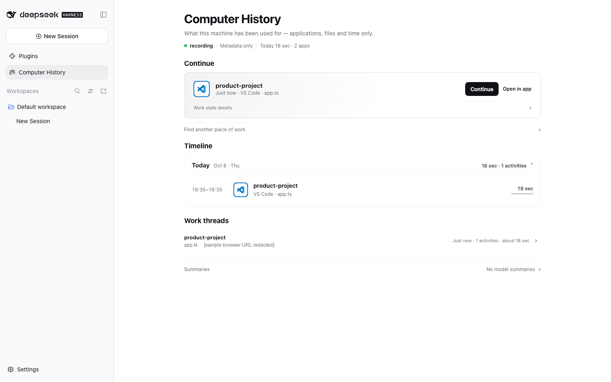
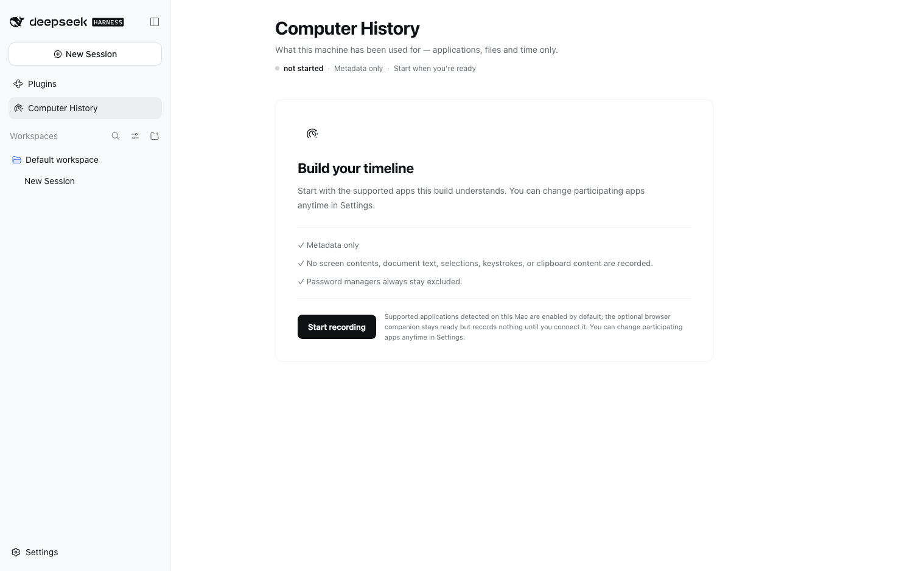

<p align="center">
  
</p>

<h1 align="center">dsh-computer-history</h1>

<p align="center"><strong>Pick up where you left off — with local, metadata-only work history for DeepSeek Harness.</strong></p>

<p align="center">Computer History turns app, resource, workspace and timing metadata into deterministic <strong>Work Episodes</strong>, so a DSH agent can understand recent work without reading the contents of your screen.</p>

<p align="center">
  <a href="https://github.com/ysr666/dsh-computer-history/stargazers"></a>
  <a href="https://github.com/ysr666/dsh-computer-history/actions/workflows/ci.yml"></a>
  <a href="https://github.com/ysr666/dsh-computer-history/actions/workflows/collectors.yml"></a>
  
  
  
</p>

<p align="center">
  
  
  
  
  <a href="LICENSE"></a>
</p>

<p align="center">English · <a href="README.zh.md">简体中文</a></p>

> [!NOTE]
> **v1.0.0 is published.** The same native-verified tarball passed the full installed-product journey and clean installation on Windows, macOS and Linux. [npm package](https://www.npmjs.com/package/dsh-computer-history/v/1.0.0) · [GitHub Release](https://github.com/ysr666/dsh-computer-history/releases/tag/v1.0.0). Host compatibility and privacy limits remain as documented.

> **v1.0.1 is also published:** [npm v1.0.1](https://www.npmjs.com/package/dsh-computer-history/v/1.0.1) · [GitHub v1.0.1](https://github.com/ysr666/dsh-computer-history/releases/tag/v1.0.1). **v1.1.0 is a release candidate only (not yet published):** [v1.1.0 notes](docs/releases/v1.1.0.md) describe Work Memory, history exploration, contextual Continue and advisory Skills/Automations. The separate [AI-first Draft PR #168](https://github.com/ysr666/dsh-computer-history/pull/168) adds bounded metadata-only evidence lookup and user-reviewed Episode → Continue; AI questions create editable, unsent drafts. Migration 0016 requires a verified backup/restore plan. **Neither PR is released**, and native Electron GUI / live-model end-to-end acceptance remain open. Compatible DSH Host versions must be verified before installation.

> [!WARNING]
> 📌 **Announcement — v1.0.0 is available on npm and GitHub.**
>
> The first public Computer History release ships as **one installable package for Windows, macOS and Linux**. It includes native collectors, an evidence-based Timeline, Continue into a DSH session, local privacy controls and optional browser/editor companions. Published artifacts passed the three-platform packaged-client tests and the macOS end-to-end journey. **Publication does not imply compatibility with untested DSH Host versions**. See [v1.0.0 notes](docs/releases/v1.0.0.md), [release evidence](docs/release.md), and [the verified release run](https://github.com/ysr666/dsh-computer-history/actions/runs/37903396146). Linux still needs a real desktop X/AT-SPI session for actual capture.
>
<p align="center">
  
  
</p>

<p align="center"><sub>Packaged DSH 0.2.0-rc.2 client with synthetic work-session data. Left: Continue, Timeline, and Work threads (example URL redacted); right: first-run privacy and recording consent.</sub></p>

## Why this exists

A chat session knows what happened **inside the chat**. Your actual work often happens somewhere else: an editor, a terminal, Finder, a browser companion, or another desktop app.

Computer History is the missing continuity layer. It is built to answer questions such as:

- **What was I working on recently?**
- **Which project or resource was that work attached to?**
- **Where should I continue?**

The design goal is deliberately different from productivity surveillance. The project records enough local metadata to reconstruct useful work context, while refusing to turn the screen, keyboard or document contents into a history feed.

## At a glance

| | Computer History |
| --- | --- |
| **Storage** | Local SQLite; no remote history service required |
| **Model** | Deterministic observations → Work Episodes → selective resume context |
| **Collection** | Include-only, off by default, fail-closed on protected or uncertain surfaces |
| **Content boundary** | Metadata only — no screenshots, keystrokes, terminal output, source bodies or page bodies |
| **DSH integration** | Authenticated Host API, agent-scoped tools, History / Privacy panel |
| **Companions** | Browser and editor paths for metadata the OS cannot safely provide |

## How it works

<p align="center">
  
</p>

The important property is what is **not** in that pipeline: screen pixels and document contents.

### Privacy boundary

| May be recorded when policy allows it | Designed never to record |
| --- | --- |
| application identity | screenshots or screen recordings |
| resource / workspace metadata | raw keyboard input or mouse coordinates |
| timestamps and duration evidence | clipboard contents |
| element role / identifier metadata | terminal output or shell history |
| privacy / protection state | source-file bodies |
| companion-provided safe resource metadata | browser page bodies |
| | Accessibility text values or selected text |

Capture starts **off**, application access is **include-only**, protected surfaces **fail closed**, and the Host re-screens metadata before storage. The exact guarantees, deletion model and residual risks live in [SECURITY.md](SECURITY.md) and [docs/threat-model.md](docs/threat-model.md).

## Platform status

| Platform | Collector path | Current status |
| --- | --- | --- |
| **macOS** | Accessibility | Packaged install + default collector handshake validated; native build/privacy/E2E gates remain green |
| **Windows** | UI Automation | Packaged install + default collector handshake validated; live Notepad → UIA → Host acceptance also green |
| **Linux** | AT-SPI | Packaged install + collector handshake validated; a real desktop session still needs its X/AT-SPI bus and permissions |

The shared collector contract is continuously checked on GitHub Actions across macOS, Windows and Linux. Live evidence and known limits are recorded in [docs/validation-three-platforms.md](docs/validation-three-platforms.md).

> [!IMPORTANT]
> The published **v1.0.0 is a single three-platform artifact**, not a macOS-only package. The release pipeline builds each
> native collector on its own OS, records its source commit and SHA-256, assembles all three into one plugin tarball,
> then clean-installs that same tarball on macOS, Windows and Linux without a `collectorExecutable` override.
> The installed client now also passes real first-run, Settings and successful History/Privacy browser checks on
> **all three platforms** ([measured evidence](docs/release.md)); macOS additionally passed a 56/56 full lifecycle
> journey. npm OIDC Trusted Publishing and byte-for-byte npm/GitHub artifact identity were verified in the [successful release](https://github.com/ysr666/dsh-computer-history/actions/runs/37903396146).

## Quick start

**Available now:** [npm `dsh-computer-history@1.0.0`](https://www.npmjs.com/package/dsh-computer-history/v/1.0.0) and the [matching GitHub Release](https://github.com/ysr666/dsh-computer-history/releases/tag/v1.0.0). Install into an existing verified DSH profile.

### 1. Install in an existing DSH profile

For the **verified DSH 0.2.0-rc.2 Host** and an existing Web profile:

```sh
npx @deepseek-ai/dsh@0.2.0-rc.2 plugin --profile web add dsh-computer-history@1.0.0
```

Use the profile that your Host actually loads. `web` is an example, **not** a global install. A new profile containing only the DSH base bundle might not serve a Web UI. Do not mix bundle-managed installation with manually inserted legacy `cordis.patch.yml` plugin entries. Reload/restart the Host after the initial installation.

### 2. Allow recording deliberately

Open **Computer History**, choose **Start recording**, then open **Settings → Computer History** to allow the specific applications you want to record. Complete any OS accessibility permissions. Recording is **off by default**, the app list is **include-only**, and disallowed apps do not appear in the Timeline. macOS needs Accessibility access, Windows uses UI Automation, and Linux needs a real desktop X/AT-SPI session and permissions.

### 3. Review the Timeline and Continue

Use an allowed app, then return to **Computer History → Timeline**. Select a Work Episode to inspect its evidence. Choose **Continue** to bring bounded, evidence-backed context into a new DSH session — it does **not** reopen apps or files.

Browser and VS Code Companions are **optional** and require their own setup and consent. See [browser setup](docs/companion.md), [editor setup](docs/editor-companion.md), and [privacy policy](SECURITY.md).

### Update or uninstall

Use the same profile. Specify an actual published package version:

```sh
# Install a specific version (change the version for future upgrades)
npx @deepseek-ai/dsh@0.2.0-rc.2 plugin --profile web add dsh-computer-history@1.0.0
# Remove from that profile
npx @deepseek-ai/dsh@0.2.0-rc.2 plugin --profile web remove dsh-computer-history
```

The tested DSH Host baseline is `0.2.0-rc.2`; `0.2.1-alpha.2` has additionally passed a macOS installed-product journey. This does **not** establish compatibility with every DSH version or platform. See [release evidence](docs/release.md) and the [v1.1.0 candidate notes](docs/releases/v1.1.0.md).

## Development from source

For development or contribution, use the source checkout:

```sh
git clone https://github.com/ysr666/dsh-computer-history.git
cd dsh-computer-history
corepack enable
pnpm install --frozen-lockfile
pnpm build
pnpm verify
```

**Requirements:** Node.js `^22.19.0` or `>=24.0.0`. Source development uses pnpm `11.7.0`; native collector builds also need Swift (macOS) or Rust (Windows/Linux). See [development](docs/development.md).

## Verification

```bash
pnpm verify                 # typecheck, lint, tests and architecture/privacy boundaries
pnpm verify:p1              # full macOS Phase 1 gate
pnpm e2e:macos              # throwaway DSH Host flow on macOS
pnpm e2e:linux              # Linux flow where the required desktop bus is available
pnpm benchmark:ingestion    # ingestion benchmark
```

Pull requests run Node 22 + 24 core verification, relevant cross-platform collector checks, and the native/performance gates when the changed paths require them.

## Documentation

| Start here | Deeper detail |
| --- | --- |
| [Architecture](ARCHITECTURE.md) | [Collector protocol](docs/collector-protocol.md) |
| [Security & privacy](SECURITY.md) | [Three-platform validation](docs/validation-three-platforms.md) |
| [Development](docs/development.md) | [Threat model](docs/threat-model.md) |
| [Roadmap](docs/roadmap.md) | [Coverage decisions](docs/coverage.md) |

## Contributing

Issues and pull requests are welcome as Computer History develops. Start with [CONTRIBUTING.md](CONTRIBUTING.md).

> [!CAUTION]
> Because this project handles sensitive local context, **do not attach real history databases, pairing/session tokens, credentials, private paths, or unredacted capture logs to public issues**. Use the private vulnerability-reporting path described in [SECURITY.md](SECURITY.md) for sensitive findings.

## Acknowledgements

Computer History for DeepSeek Harness was inspired by [OpenAI's Computer History](https://help.openai.com/en/articles/6825453-chatgpt-release-notes), particularly its vision of helping AI assistants understand recent work context and continue where users left off. We thank OpenAI for pioneering this product direction.

We also thank the maintainers of [DeepSeek Harness](https://github.com/deepseek-ai/deepseek-harness) for building the open and extensible foundation that makes this project possible.

Computer History is an independently developed community implementation for DeepSeek Harness. It is not affiliated with or endorsed by OpenAI or DeepSeek.

## License

[MIT](LICENSE)

<!-- star-history-chart -->
## Star History

<p align="center">
  <a href="https://www.star-history.com/?repos=ysr666%2Fdsh-computer-history&type=date&legend=top-left">
    <picture>
      <source media="(prefers-color-scheme: dark)" srcset="https://api.star-history.com/chart?repos=ysr666/dsh-computer-history&type=date&theme=dark&legend=top-left" />
      <source media="(prefers-color-scheme: light)" srcset="https://api.star-history.com/chart?repos=ysr666/dsh-computer-history&type=date&legend=top-left" />
      
    </picture>
  </a>
</p>
