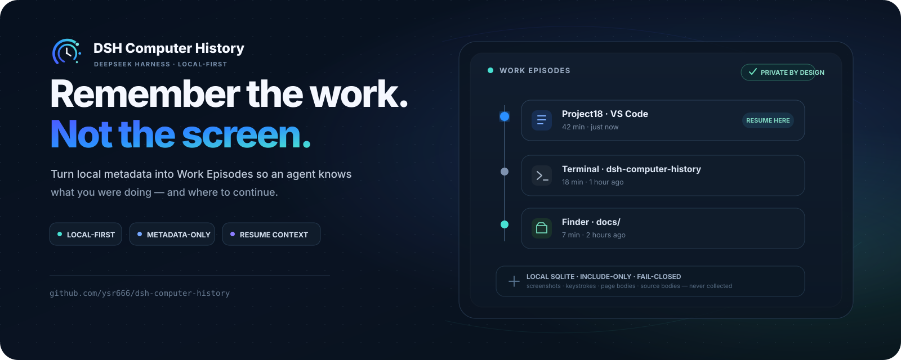
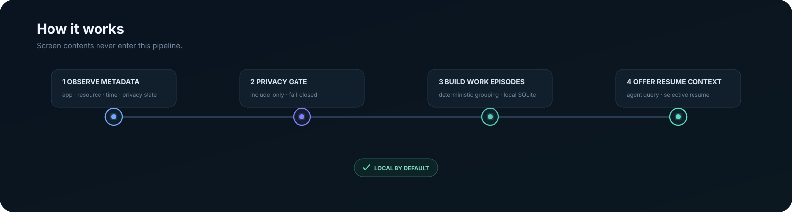

<p align="center">
  
</p>

<h1 align="center">dsh-computer-history</h1>

<p align="center"><strong>Pick up where you left off — with local, metadata-only work history for DeepSeek Harness.</strong></p>

<p align="center">Computer History turns app, resource, workspace and timing metadata into deterministic <strong>Work Episodes</strong>, so a DSH agent can understand recent work without reading the contents of your screen.</p>

<p align="center">
  <a href="https://github.com/ysr666/dsh-computer-history/actions/workflows/ci.yml"></a>
  <a href="https://github.com/ysr666/dsh-computer-history/actions/workflows/collectors.yml"></a>
  
  
  
</p>

<p align="center">
  
  
  
  
  <a href="LICENSE"></a>
</p>

<p align="center">English · <a href="README.zh.md">简体中文</a></p>

> [!NOTE]
> **v1.0.0 release candidate — not published yet.** One three-platform package has passed clean-install/browser verification, but the public npm package, tag and GitHub Release do not exist yet. Use the documented compatibility and privacy constraints.

> [!WARNING]
> 📌 **Announcement — v1.0.0 release candidate (not yet available on npm).**
>
> The first public Computer History release is planned as one installable package for Windows, macOS and Linux. It includes the native collectors, evidence-based Timeline, Continue into a DSH session, local privacy controls and browser/editor companions. Three-platform packaged-client verification and the macOS end-to-end product journey have passed; **this is not a claim of a published or fully supported product**. See [v1.0.0 notes](docs/releases/v1.0.0.md) and [release status](docs/release.md). Linux still needs a real desktop X/AT-SPI session for actual capture.
>
<p align="center">
  
  
</p>

<p align="center"><sub>Recent Work Episodes on the left; the first-run privacy flow on the right.</sub></p>

## Why this exists

A chat session knows what happened **inside the chat**. Your actual work often happens somewhere else: an editor, a terminal, Finder, a browser companion, or another desktop app.

Computer History is the missing continuity layer. It is built to answer questions such as:

- **What was I working on recently?**
- **Which project or resource was that work attached to?**
- **Where should I continue?**

The design goal is deliberately different from productivity surveillance. The project records enough local metadata to reconstruct useful work context, while refusing to turn the screen, keyboard or document contents into a history feed.

## At a glance

| | Computer History |
| --- | --- |
| **Storage** | Local SQLite; no remote history service required |
| **Model** | Deterministic observations → Work Episodes → selective resume context |
| **Collection** | Include-only, off by default, fail-closed on protected or uncertain surfaces |
| **Content boundary** | Metadata only — no screenshots, keystrokes, terminal output, source bodies or page bodies |
| **DSH integration** | Authenticated Host API, agent-scoped tools, History / Privacy panel |
| **Companions** | Browser and editor paths for metadata the OS cannot safely provide |

## How it works

<p align="center">
  
</p>

The important property is what is **not** in that pipeline: screen pixels and document contents.

### Privacy boundary

| May be recorded when policy allows it | Designed never to record |
| --- | --- |
| application identity | screenshots or screen recordings |
| resource / workspace metadata | raw keyboard input or mouse coordinates |
| timestamps and duration evidence | clipboard contents |
| element role / identifier metadata | terminal output or shell history |
| privacy / protection state | source-file bodies |
| companion-provided safe resource metadata | browser page bodies |
| | Accessibility text values or selected text |

Capture starts **off**, application access is **include-only**, protected surfaces **fail closed**, and the Host re-screens metadata before storage. The exact guarantees, deletion model and residual risks live in [SECURITY.md](SECURITY.md) and [docs/threat-model.md](docs/threat-model.md).

## Platform status

| Platform | Collector path | Current status |
| --- | --- | --- |
| **macOS** | Accessibility | Packaged install + default collector handshake validated; native build/privacy/E2E gates remain green |
| **Windows** | UI Automation | Packaged install + default collector handshake validated; live Notepad → UIA → Host acceptance also green |
| **Linux** | AT-SPI | Packaged install + collector handshake validated; a real desktop session still needs its X/AT-SPI bus and permissions |

The shared collector contract is continuously checked on GitHub Actions across macOS, Windows and Linux. Live evidence and known limits are recorded in [docs/validation-three-platforms.md](docs/validation-three-platforms.md).

> [!IMPORTANT]
> The planned **v1.0.0 is a single three-platform artifact**, not a macOS-only package. The release pipeline builds each
> native collector on its own OS, records its source commit and SHA-256, assembles all three into one plugin tarball,
> then clean-installs that same tarball on macOS, Windows and Linux without a `collectorExecutable` override.
> The installed client now also passes real first-run, Settings and successful History/Privacy browser checks on
> **all three platforms** ([measured evidence](docs/release.md)); macOS additionally passes a 52/52 full lifecycle
> journey. Publishing still requires the approved npm namespace, Trusted Publishing and the final release preflight.

## Install and development

**After publication**, install directly from npm in your chosen DSH profile:

```bash
dsh plugin --profile <profile> add dsh-computer-history
```

Until the [v1.0.0 Release](https://github.com/ysr666/dsh-computer-history/releases/tag/v1.0.0) and [npm package](https://www.npmjs.com/package/dsh-computer-history) actually exist, use the development checkout below instead. The plugin starts with capture off; first-run consent and platform permissions are required. The Browser and VS Code companions may need separate pairing/setup.

```bash
git clone https://github.com/ysr666/dsh-computer-history.git
cd dsh-computer-history
corepack enable
pnpm install --frozen-lockfile
pnpm build
pnpm verify
```

**Requirements**

- Node.js `^22.19.0` or `>=24`
- pnpm `11.7.0`
- Rust for Windows/Linux collector work
- Swift toolchain for native macOS work

For DSH integration, throwaway-host testing and platform-specific validation, see [docs/development.md](docs/development.md).

## Verification

```bash
pnpm verify                 # typecheck, lint, tests and architecture/privacy boundaries
pnpm verify:p1              # full macOS Phase 1 gate
pnpm e2e:macos              # throwaway DSH Host flow on macOS
pnpm e2e:linux              # Linux flow where the required desktop bus is available
pnpm benchmark:ingestion    # ingestion benchmark
```

Pull requests run Node 22 + 24 core verification, relevant cross-platform collector checks, and the native/performance gates when the changed paths require them.

## Documentation

| Start here | Deeper detail |
| --- | --- |
| [Architecture](ARCHITECTURE.md) | [Collector protocol](docs/collector-protocol.md) |
| [Security & privacy](SECURITY.md) | [Three-platform validation](docs/validation-three-platforms.md) |
| [Development](docs/development.md) | [Threat model](docs/threat-model.md) |
| [Roadmap](docs/roadmap.md) | [Coverage decisions](docs/coverage.md) |

## Contributing

Issues and pull requests are welcome while the first public release is prepared. Start with [CONTRIBUTING.md](CONTRIBUTING.md).

> [!CAUTION]
> Because this project handles sensitive local context, **do not attach real history databases, pairing/session tokens, credentials, private paths, or unredacted capture logs to public issues**. Use the private vulnerability-reporting path described in [SECURITY.md](SECURITY.md) for sensitive findings.

## Acknowledgements

Computer History for DeepSeek Harness was inspired by [OpenAI's Computer History](https://help.openai.com/en/articles/6825453-chatgpt-release-notes), particularly its vision of helping AI assistants understand recent work context and continue where users left off. We thank OpenAI for pioneering this product direction.

We also thank the maintainers of [DeepSeek Harness](https://github.com/deepseek-ai/deepseek-harness) for building the open and extensible foundation that makes this project possible.

Computer History is an independently developed community implementation for DeepSeek Harness. It is not affiliated with or endorsed by OpenAI or DeepSeek.

## License

[MIT](LICENSE)
