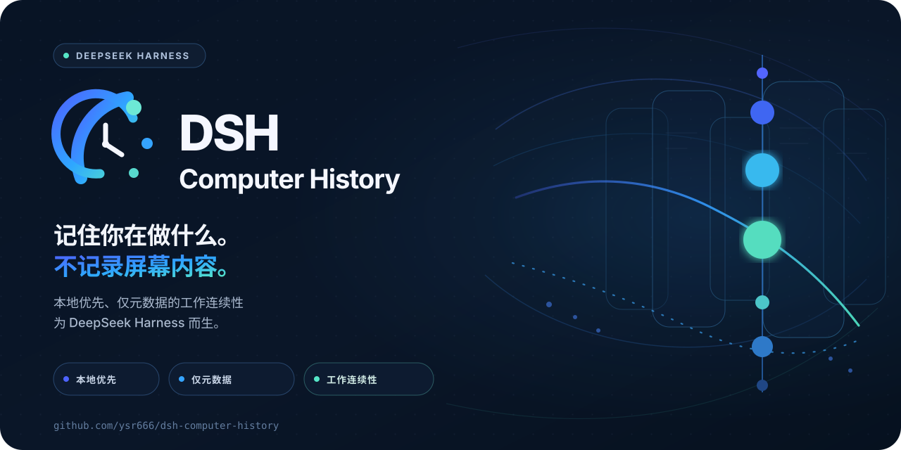
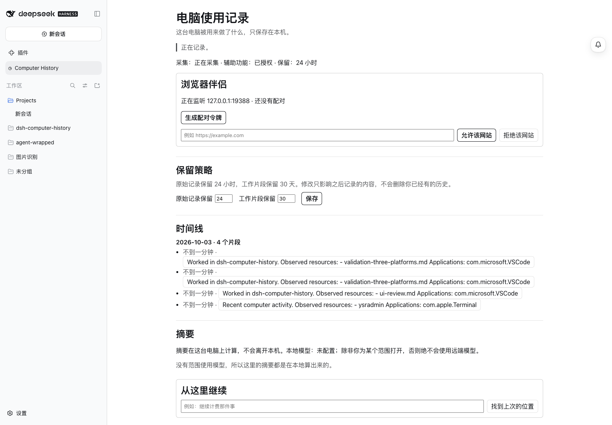
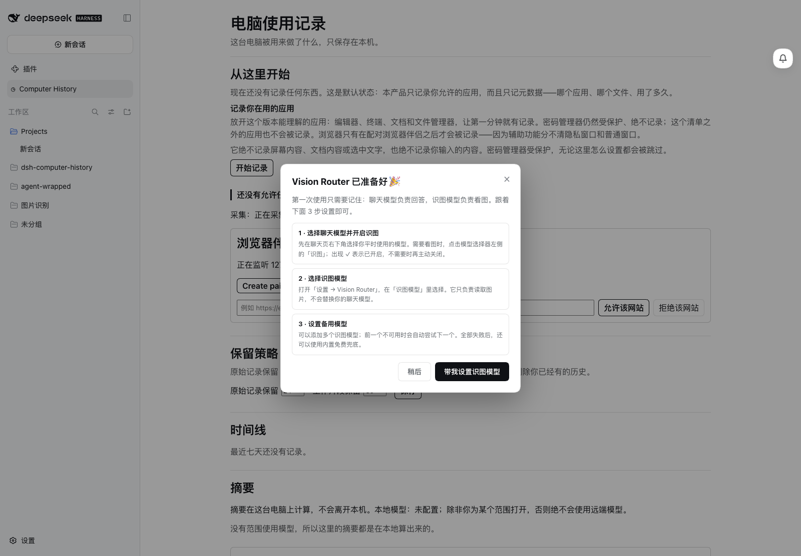
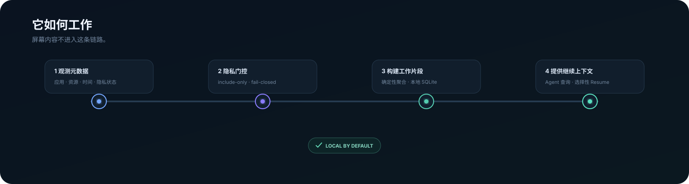

<p align="center">
  
</p>

<h1 align="center">dsh-computer-history</h1>

<p align="center"><strong>知道你刚才在做什么，然后从正确的位置继续——本地优先、仅元数据。</strong></p>

<p align="center">Computer History 把应用、资源、工作区和时间等元数据整理成确定性的 <strong>Work Episodes（工作片段）</strong>，让 DSH Agent 理解最近的工作，而不读取你的屏幕内容。</p>

<p align="center">
  <a href="https://github.com/ysr666/dsh-computer-history/actions/workflows/ci.yml"></a>
  <a href="https://github.com/ysr666/dsh-computer-history/actions/workflows/collectors.yml"></a>
  
  
  
</p>

<p align="center">
  
  
  
  
  <a href="LICENSE"></a>
</p>

<p align="center"><a href="README.md">English</a> · 简体中文</p>

> [!NOTE]
> **Early alpha。** 三个平台采集目标的核心链路已经实现并经过仓库内验证，但目前还没有稳定的打包 Release；安装和兼容性细节仍可能变化。

<p align="center">
  
  
</p>

<p align="center"><sub>左：最近的 Work Episodes；右：首次使用时的隐私与开始记录流程。</sub></p>

## 为什么做这个

聊天 Session 知道**聊天里**发生过什么，但你的真实工作经常发生在别处：编辑器、Terminal、Finder、浏览器伴侣，或其他桌面应用。

Computer History 补的是这层“工作连续性”。它希望回答：

- **我刚才主要在做什么？**
- **这些工作属于哪个项目或资源？**
- **我下一步应该从哪里继续？**

它和“生产力监控”刻意不是同一种产品。目标是只保存足够恢复工作上下文的本机元数据，同时拒绝把屏幕、键盘和文档正文变成历史记录。

## 一眼看懂

| | Computer History |
| --- | --- |
| **存储** | 本地 SQLite；不需要远程历史服务 |
| **模型** | 确定性 Observation → Work Episode → 选择性 Resume 上下文 |
| **采集** | 默认关闭、include-only，遇到受保护或不确定界面时 fail-closed |
| **内容边界** | 仅元数据——不记录截图、按键、终端正文、源码正文或网页正文 |
| **DSH 集成** | 认证 Host API、Agent 作用域工具、History / Privacy 面板 |
| **Companion** | 浏览器与编辑器可通过伴侣补充 OS 无法安全提供的元数据 |

## 它怎么工作

<p align="center">
  
</p>

这条链路最重要的性质，是**屏幕像素和文档正文不在里面**。

### 隐私边界

| 策略允许时可能记录 | 设计上明确不记录 |
| --- | --- |
| 应用身份 | 截图或屏幕录像 |
| 资源 / 工作区元数据 | 原始键盘输入或鼠标坐标 |
| 时间戳与持续时间证据 | 剪贴板内容 |
| 元素 role / identifier 元数据 | Terminal 输出或 shell history |
| 隐私 / 保护状态 | 源文件正文 |
| Companion 提供的安全资源元数据 | 浏览器网页正文 |
| | Accessibility 文本值或选中文本 |

采集默认**关闭**，应用访问为 **include-only**，受保护界面 **fail-closed**，Host 在写入存储前还会再次检查元数据。精确的安全边界、删除模型与残余风险见 [SECURITY.zh.md](SECURITY.zh.md) 与 [docs/threat-model.md](docs/threat-model.md)。

## 平台状态

| 平台 | Collector 路径 | 当前状态 |
| --- | --- | --- |
| **macOS** | Accessibility | 主路径；原生构建、隐私测试与端到端流程已验证 |
| **Windows** | UI Automation | 已在 Windows 11 实机验证 live collector + Host 流程 |
| **Linux** | AT-SPI | 已在 Ubuntu 实机验证 collector/protocol 路径；桌面总线与权限仍影响可用性 |

共享 collector contract 会在 GitHub Actions 上持续跨 macOS、Windows、Linux 检查。实机证据和已知限制记录在 [docs/validation-three-platforms.md](docs/validation-three-platforms.md)。

## 开发快速开始

目前还没有稳定的打包 Release，因此当前支持的入口是源码检出。

```bash
git clone https://github.com/ysr666/dsh-computer-history.git
cd dsh-computer-history
corepack enable
pnpm install --frozen-lockfile
pnpm build
pnpm verify
```

**环境要求**

- Node.js `^22.19.0` 或 `>=24`
- pnpm `11.7.0`
- Windows/Linux collector 开发需要 Rust
- macOS 原生 collector 开发需要 Swift toolchain

DSH 集成、临时 Host 测试以及各平台验证方式见 [docs/development.md](docs/development.md)。

## 验证

```bash
pnpm verify                 # 类型、lint、测试、架构/隐私边界
pnpm verify:p1              # 完整 macOS Phase 1 gate
pnpm e2e:macos              # macOS 临时 DSH Host 流程
pnpm e2e:linux              # 具备所需 desktop bus 时的 Linux 流程
pnpm benchmark:ingestion    # ingestion benchmark
```

Pull Request 会运行 Node 22 + 24 核心验证、相关的三平台 collector 检查，以及在改动路径需要时运行 native / performance gate。

## 文档

| 从这里开始 | 更深入 |
| --- | --- |
| [架构](ARCHITECTURE.md) | [Collector protocol](docs/collector-protocol.md) |
| [安全与隐私](SECURITY.zh.md) | [三平台验证](docs/validation-three-platforms.md) |
| [开发](docs/development.md) | [Threat model](docs/threat-model.md) |
| [Roadmap](docs/roadmap.md) | [Coverage 决策](docs/coverage.md) |

## 参与贡献

项目仍处于 Alpha，欢迎 Issue 和 Pull Request。开始前请阅读 [CONTRIBUTING.md](CONTRIBUTING.md)。

> [!CAUTION]
> 本项目处理敏感的本地上下文。**不要在公开 Issue 中上传真实历史数据库、配对/Session Token、凭据、私密路径或未脱敏采集日志。** 涉及安全问题时，请按 [SECURITY.zh.md](SECURITY.zh.md) 中的私密漏洞上报方式处理。

## License

[MIT](LICENSE)
