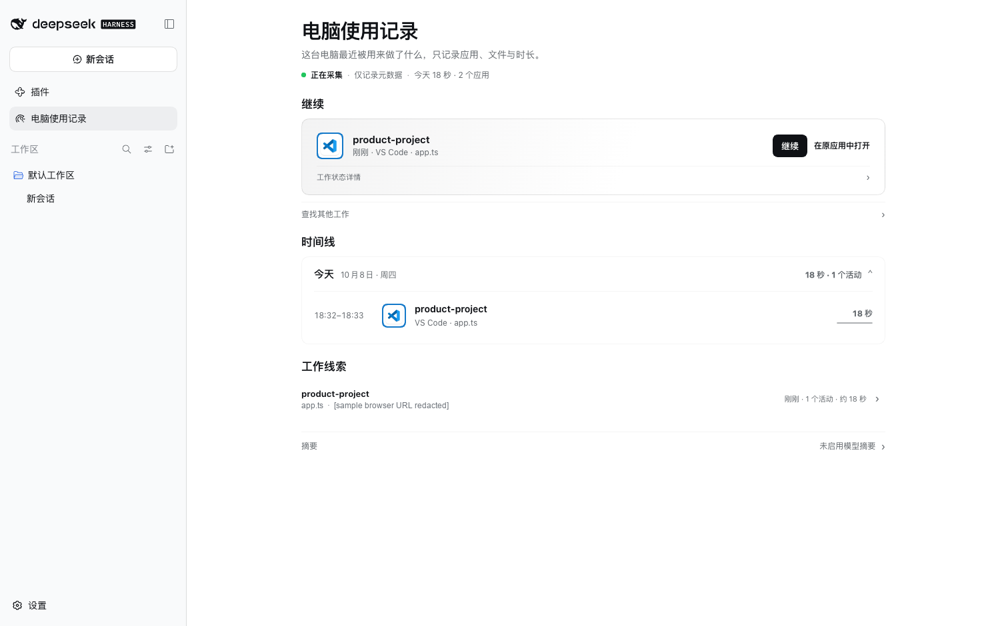
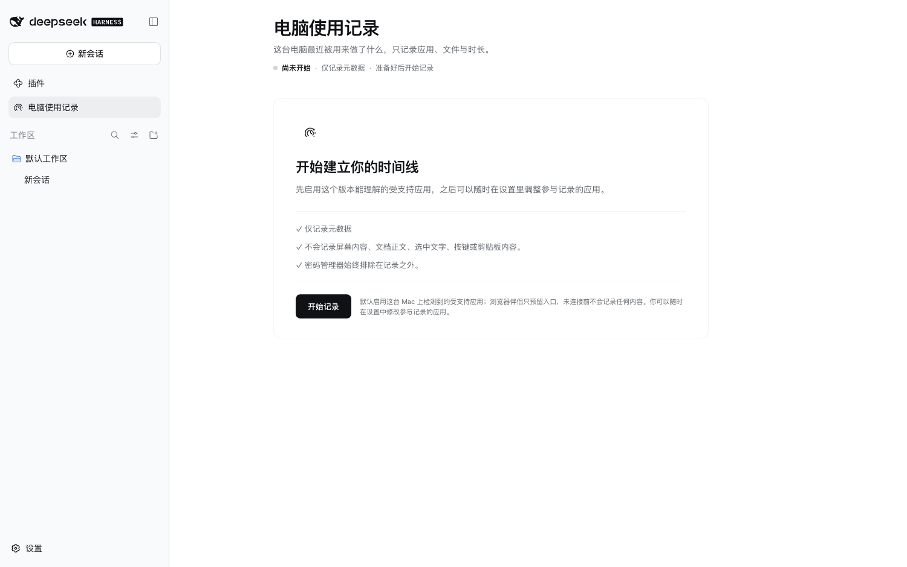

<p align="center">
  
</p>

<h1 align="center">dsh-computer-history</h1>

<p align="center"><strong>知道你刚才在做什么，然后从正确的位置继续——本地优先、仅元数据。</strong></p>

<p align="center">Computer History 把应用、资源、工作区和时间等元数据整理成确定性的 <strong>Work Episodes（工作片段）</strong>，让 DSH Agent 理解最近的工作，而不读取你的屏幕内容。</p>

<p align="center">
  <a href="https://github.com/ysr666/dsh-computer-history/stargazers"></a>
  <a href="https://github.com/ysr666/dsh-computer-history/actions/workflows/ci.yml"></a>
  <a href="https://github.com/ysr666/dsh-computer-history/actions/workflows/collectors.yml"></a>
  
  
  
</p>

<p align="center">
  
  
  
  
  <a href="LICENSE"></a>
</p>

<p align="center"><a href="README.md">English</a> · 简体中文</p>

> [!NOTE]
> **v1.0.0 已正式发布。** 同一份包含三平台原生采集器的安装包已通过完整产品流程和 Windows、macOS、Linux 干净安装验收。[npm 软件包](https://www.npmjs.com/package/dsh-computer-history/v/1.0.0) · [GitHub Release](https://github.com/ysr666/dsh-computer-history/releases/tag/v1.0.0)。Host 兼容性和隐私边界仍以文档为准。

> **v1.0.1 也已发布：** [npm v1.0.1](https://www.npmjs.com/package/dsh-computer-history/v/1.0.1) · [GitHub v1.0.1](https://github.com/ysr666/dsh-computer-history/releases/tag/v1.0.1)。**v1.1.0 目前只是发布候选（尚未发布）：** [v1.1.0 说明](docs/releases/v1.1.0.md)介绍工作记忆、历史检索、Contextual Continue 与 Skill/Automation 建议。安装前必须核实 DSH Host 兼容性。

> [!WARNING]
> 📌 **公告：v1.0.0 已在 npm 和 GitHub 正式发布**
>
> Computer History 首个公开版本使用**同一份三平台插件包**支持 Windows / macOS / Linux，提供基于证据的时间线、原生 DSH Continue、本地隐私控制及可选浏览器/编辑器 Companion。正式发布包已通过三平台打包验收和 macOS 完整产品流程。**正式发布不等于已验证所有 DSH Host 版本**；Linux 真实桌面采集仍需 X/AT-SPI 环境和权限。详情见 [v1.0.0 发布说明](docs/releases/v1.0.0.md)、[发布证据](docs/release.md)和[成功的 Release 工作流](https://github.com/ysr666/dsh-computer-history/actions/runs/37903396146)。
>
<p align="center">
  
  
</p>

<p align="center"><sub>截图来自 DSH 0.2.0-rc.2 真正安装后的客户端，使用隔离环境中的模拟工作记录。左：继续工作、时间线和工作线索（示例 URL 已遮盖）；右：首次使用的隐私说明和开始记录授权。</sub></p>

## 为什么做这个

聊天 Session 知道**聊天里**发生过什么，但你的真实工作经常发生在别处：编辑器、Terminal、Finder、浏览器伴侣，或其他桌面应用。

Computer History 补的是这层“工作连续性”。它希望回答：

- **我刚才主要在做什么？**
- **这些工作属于哪个项目或资源？**
- **我下一步应该从哪里继续？**

它和“生产力监控”刻意不是同一种产品。目标是只保存足够恢复工作上下文的本机元数据，同时拒绝把屏幕、键盘和文档正文变成历史记录。

## 一眼看懂

| | Computer History |
| --- | --- |
| **存储** | 本地 SQLite；不需要远程历史服务 |
| **模型** | 确定性 Observation → Work Episode → 选择性 Resume 上下文 |
| **采集** | 默认关闭、include-only，遇到受保护或不确定界面时 fail-closed |
| **内容边界** | 仅元数据——不记录截图、按键、终端正文、源码正文或网页正文 |
| **DSH 集成** | 认证 Host API、Agent 作用域工具、History / Privacy 面板 |
| **Companion** | 浏览器与编辑器可通过伴侣补充 OS 无法安全提供的元数据 |

## 它怎么工作

<p align="center">
  
</p>

这条链路最重要的性质，是**屏幕像素和文档正文不在里面**。

### 隐私边界

| 策略允许时可能记录 | 设计上明确不记录 |
| --- | --- |
| 应用身份 | 截图或屏幕录像 |
| 资源 / 工作区元数据 | 原始键盘输入或鼠标坐标 |
| 时间戳与持续时间证据 | 剪贴板内容 |
| 元素 role / identifier 元数据 | Terminal 输出或 shell history |
| 隐私 / 保护状态 | 源文件正文 |
| Companion 提供的安全资源元数据 | 浏览器网页正文 |
| | Accessibility 文本值或选中文本 |

采集默认**关闭**，应用访问为 **include-only**，受保护界面 **fail-closed**，Host 在写入存储前还会再次检查元数据。精确的安全边界、删除模型与残余风险见 [SECURITY.zh.md](SECURITY.zh.md) 与 [docs/threat-model.md](docs/threat-model.md)。

## 平台状态

| 平台 | Collector 路径 | 当前状态 |
| --- | --- | --- |
| **macOS** | Accessibility | 已验证打包安装 + 默认 collector 握手；原生构建、隐私与 E2E gate 持续通过 |
| **Windows** | UI Automation | 已验证打包安装 + 默认 collector 握手；真实 Notepad → UIA → Host 验收也持续通过 |
| **Linux** | AT-SPI | 已验证打包安装 + collector 握手；真实桌面使用仍需要 X/AT-SPI 总线与相应权限 |

共享 collector contract 会在 GitHub Actions 上持续跨 macOS、Windows、Linux 检查。实机证据和已知限制记录在 [docs/validation-three-platforms.md](docs/validation-three-platforms.md)。

> [!IMPORTANT]
> 已发布的 **v1.0.0** 使用**同一个三平台插件包**，不是 macOS-only。Release 流水线会在三个原生
> runner 上分别构建 collector，记录来源 commit 与 SHA-256，把三份原生二进制合进同一个 tarball，
> 再让 macOS、Windows、Linux 分别 clean install 这一模一样的 tarball；验证时不设置
> `collectorExecutable`，因此证明的是安装包自己的平台选择。同一安装包的客户端还通过了三端真实浏览器
> 首次使用、Settings 和 History/Privacy HTTP 200 验收（见[发布证据](docs/release.md)）；macOS 另有 56/56
> 完整生命周期验证。npm OIDC Trusted Publishing 与 npm/GitHub 安装包字节一致性均已在[正式发布工作流](https://github.com/ysr666/dsh-computer-history/actions/runs/37903396146)核验。

## 快速开始

**现已可安装：** [npm `dsh-computer-history@1.0.0`](https://www.npmjs.com/package/dsh-computer-history/v/1.0.0) 与[对应的 GitHub Release](https://github.com/ysr666/dsh-computer-history/releases/tag/v1.0.0)。请安装到已经配置好的、经过验证的 DSH profile 中。

### 1. 安装到已有的 DSH profile

以经过验证的 **DSH 0.2.0-rc.2 Host** 和已能使用 Web UI 的 `web` profile 为例：

```sh
npx @deepseek-ai/dsh@0.2.0-rc.2 plugin --profile web add dsh-computer-history@1.0.0
```

请指定 Host **实际加载的 profile**：`web` 仅是例子，不是全局安装。只含 DSH 基础组件的新 profile 可能无法启动 Web UI。不要与旧式手动插入 `cordis.patch.yml` 插件的方式混用。首次安装后重新加载或重启对应 Host。

### 2. 主动授权记录范围

在 DSH 中打开 **Computer History**，选择**开始记录**，然后到 **设置 → Computer History** 选择明确允许记录的应用，并完成系统要求的辅助功能授权。采集**默认关闭**，应用采用**明确允许名单**；不在名单内的应用不会进入时间线。macOS 使用 Accessibility 权限，Windows 使用 UI Automation，Linux 真正采集需要桌面 X/AT-SPI 会话及权限。

### 3. 查看时间线并继续工作

使用被允许的应用一段时间，再回到 **Computer History → 时间线**。选择 Work Episode 查看证据，点击 **Continue（继续）** 将有限、可核实的上下文带到新的 DSH Session。Continue **不会**替你打开应用或文件。

浏览器与 VS Code Companion 都是**可选组件**，需要分别设置与授权。详见[浏览器设置](docs/companion.zh.md)、[编辑器设置](docs/editor-companion.zh.md)和[隐私说明](SECURITY.zh.md)。

### 更新或卸载

使用安装时**同一个 profile**，并明确指定已发布版本：

```sh
# 安装指定版本；以后升级可替换版本号
npx @deepseek-ai/dsh@0.2.0-rc.2 plugin --profile web add dsh-computer-history@1.0.0
# 从该 profile 卸载
npx @deepseek-ai/dsh@0.2.0-rc.2 plugin --profile web remove dsh-computer-history
```

已验证的 DSH Host 基线为 `0.2.0-rc.2`；`0.2.1-alpha.2` 另外通过了 macOS 安装版完整产品验收。这**不代表**所有 DSH 版本或其他平台都已验证兼容。参见[发布证据](docs/release.md)和 [v1.1.0 候选说明](docs/releases/v1.1.0.md)。

## 源码开发

进行开发或贡献时，可使用源码 checkout：

```sh
git clone https://github.com/ysr666/dsh-computer-history.git
cd dsh-computer-history
corepack enable
pnpm install --frozen-lockfile
pnpm build
pnpm verify
```

**环境要求：** Node.js `^22.19.0` 或 `>=24.0.0`，源码开发使用 pnpm `11.7.0`，原生采集器构建还需要 Swift（macOS）或 Rust（Windows/Linux）。详见[开发指南](docs/development.md)。

## 验证

```bash
pnpm verify                 # 类型、lint、测试、架构/隐私边界
pnpm verify:p1              # 完整 macOS Phase 1 gate
pnpm e2e:macos              # macOS 临时 DSH Host 流程
pnpm e2e:linux              # 具备所需 desktop bus 时的 Linux 流程
pnpm benchmark:ingestion    # ingestion benchmark
```

Pull Request 会运行 Node 22 + 24 核心验证、相关的三平台 collector 检查，以及在改动路径需要时运行 native / performance gate。

## 文档

| 从这里开始 | 更深入 |
| --- | --- |
| [架构](ARCHITECTURE.md) | [Collector protocol](docs/collector-protocol.md) |
| [安全与隐私](SECURITY.zh.md) | [三平台验证](docs/validation-three-platforms.md) |
| [开发](docs/development.md) | [Threat model](docs/threat-model.md) |
| [Roadmap](docs/roadmap.md) | [Coverage 决策](docs/coverage.md) |

## 参与贡献

项目正在准备首个公开正式版，欢迎 Issue 和 Pull Request。开始前请阅读 [CONTRIBUTING.md](CONTRIBUTING.md)。

> [!CAUTION]
> 本项目处理敏感的本地上下文。**不要在公开 Issue 中上传真实历史数据库、配对/Session Token、凭据、私密路径或未脱敏采集日志。** 涉及安全问题时，请按 [SECURITY.zh.md](SECURITY.zh.md) 中的私密漏洞上报方式处理。

## 致谢

Computer History for DeepSeek Harness 的产品理念受到 [OpenAI Computer History](https://help.openai.com/en/articles/6825453-chatgpt-release-notes) 的启发，尤其是让 AI 助手理解近期工作上下文、帮助用户从上次中断的地方继续工作的构想。感谢 OpenAI 对这一产品方向的探索与开创。

同时，感谢 [DeepSeek Harness](https://github.com/deepseek-ai/deepseek-harness) 的开发与维护者，为本项目提供了开放、可扩展的技术基础。

Computer History 是面向 DeepSeek Harness 独立开发的社区项目，不隶属于 OpenAI 或 DeepSeek，也不代表任何一方的官方立场。

## License

[MIT](LICENSE)

<!-- star-history-chart -->
## Star 趋势

<p align="center">
  <a href="https://www.star-history.com/?repos=ysr666%2Fdsh-computer-history&type=date&legend=top-left">
    <picture>
      <source media="(prefers-color-scheme: dark)" srcset="https://api.star-history.com/chart?repos=ysr666/dsh-computer-history&type=date&theme=dark&legend=top-left" />
      <source media="(prefers-color-scheme: light)" srcset="https://api.star-history.com/chart?repos=ysr666/dsh-computer-history&type=date&legend=top-left" />
      
    </picture>
  </a>
</p>
